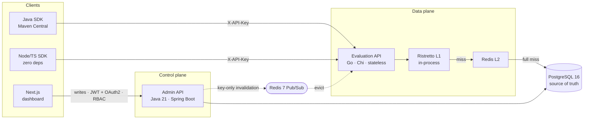

By day I own the backend of a multi-tenant platform — Java 17 / Spring Boot 3 on Azure SQL, database-per-tenant isolation across 10+ client organizations. Nights go to distributed-systems side work, mainly the project below.

## feature-flag

[**feature-flag**](https://github.com/07manan/feature-flag) is a flag-and-config platform split into a control plane and a data plane: a Java 21 / Spring Boot Admin API that owns every write (JWT + Google OAuth2 login, role-based access), and a stateless Go (Chi) Evaluation API on the read hot path. PostgreSQL 16 is the source of truth; Redis 7 doubles as the shared cache and the invalidation bus.



**Decisions I'd defend:**

- **Control plane and data plane are separate services in separate languages.** Writes, auth, and CRUD live in Spring; the latency-critical read path is served by a stateless Go service designed to scale horizontally without dragging any of that along.
- **Cache invalidation is delete-only over Pub/Sub, and publishing is fire-and-forget.** Writes emit key-only events, read nodes evict and lazily re-read on the next miss — a Redis outage never fails a write, and convergence needs no coordinator and no DB polling.
- **Percentage rollouts are a pure function, not a table.** A hand-written MurmurHash3 buckets each (flag, user) pair into 0–99, so the same user gets the same variant on every node with zero stored per-user state.
- **The SDK fails asymmetrically.** A missing flag or an unreachable API returns the caller's default so the app keeps running; a 401 is always re-thrown so a bad key fails loudly instead of degrading silently.

The repo also has a Go load-test harness (token-bucket pacing, HdrHistogram, four load shapes). It [measured](https://github.com/07manan/feature-flag/tree/main/benchmarking/results) p50 ~0.34 ms / p99 ~3 ms at ~1,000 RPS over a 10-minute constant run — on a single machine over loopback, so a micro-benchmark, not an SLO.

The Java SDK is [published to Maven Central](https://repo1.maven.org/maven2/io/github/07manan/featureflags-java-sdk/1.0.0/):

```kotlin
implementation("io.github.07manan:featureflags-java-sdk:1.0.0")
```

The Node/TypeScript SDK is built on native `fetch` and `AbortSignal.timeout` with zero runtime dependencies — no transitive supply-chain surface for consumers.

Day to day: Java · Spring Boot · Go · Angular · Python · SQL · PostgreSQL · Redis · Docker · Kubernetes (AKS) · Azure.

Find me on [LinkedIn](https://www.linkedin.com/in/mananrpatel/).
